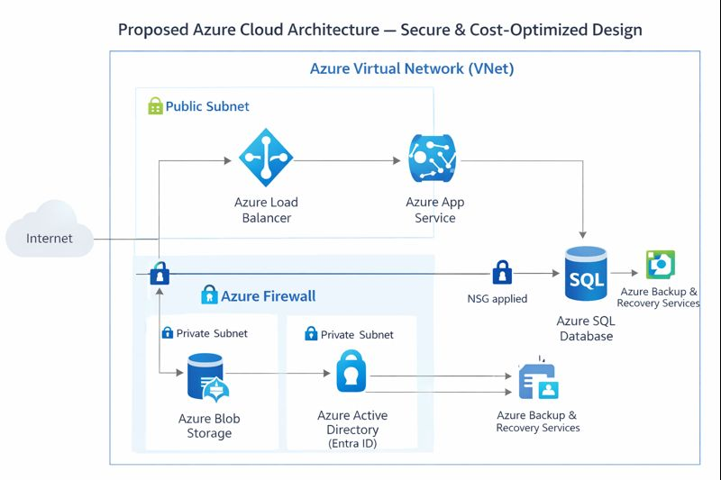

# Azure Cloud Architecture Design

## Architecture Overview
The proposed architecture is designed for scalability, security and high availability using Microsoft Azure services.

### Core Components
- Azure Virtual Network (VNet)
- Azure App Service (Web Application)
- Azure SQL Database
- Azure Blob Storage
- Azure Active Directory (Entra ID)
- Azure Firewall
- Azure Load Balancer
- Azure Backup & Recovery Services

## Network Design
- Public subnet for web layer
- Private subnet for database layer
- Network Security Groups controlling inbound/outbound traffic
- Azure Firewall protecting the perimeter

## Identity & Access Management
- Role-Based Access Control (RBAC)
- Multi-Factor Authentication (MFA)
- Least privilege access model

## Security Controls
- Data encryption at rest and in transit
- Secure storage access policies
- Continuous monitoring & logging

## High Availability & Resilience
- Load-balanced web services
- Geo-redundant backups
- Disaster recovery strategy
